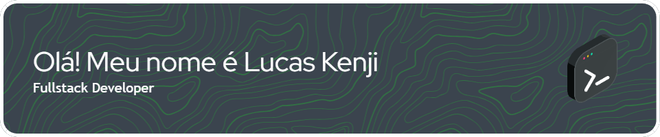

- 🔭 Desenvolvedor Full Stack 
- 🏛️ Formado como Tecnólogo em Análise e Desenvolvimento de Sistemas na FIAP
- ⚛️ Fascinado por React, Typescript e .NET
- 🔨 Em busca da primeira oportunidade de emprego na área de tecnologia

    
    
    

## Tecnologias que conheço 💻

 
  
  
  
  
  
  
  
  
  
  
  
  
  
  
  
  
  

 

